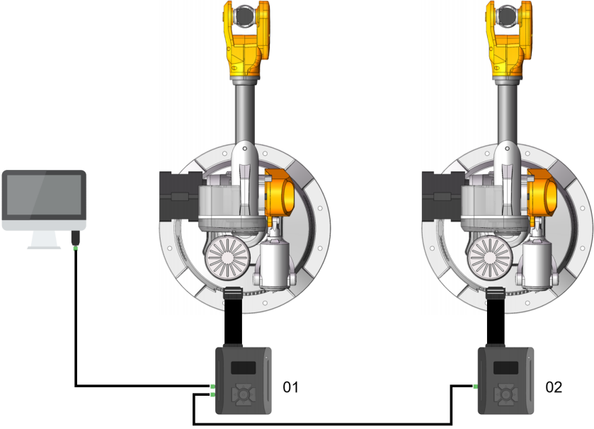
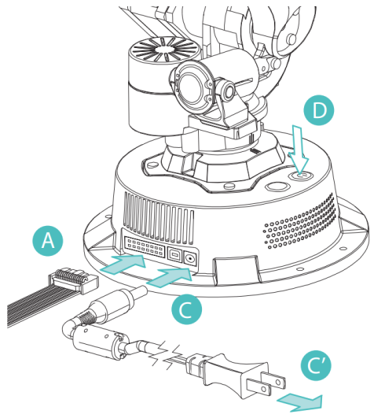
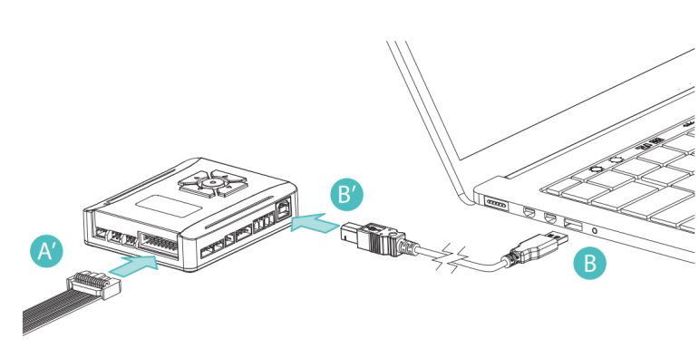
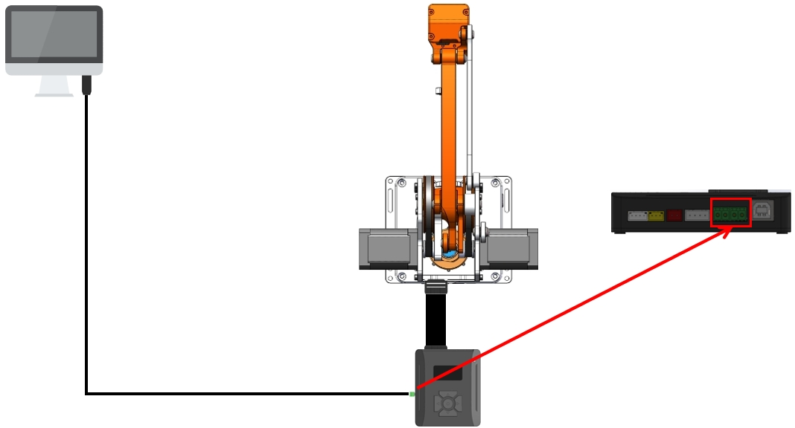
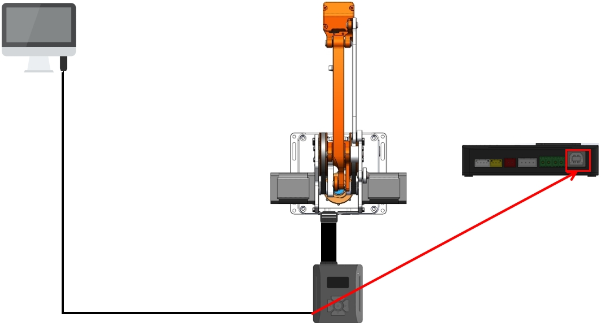
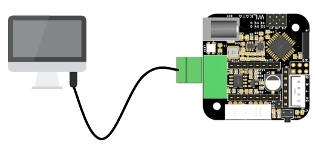
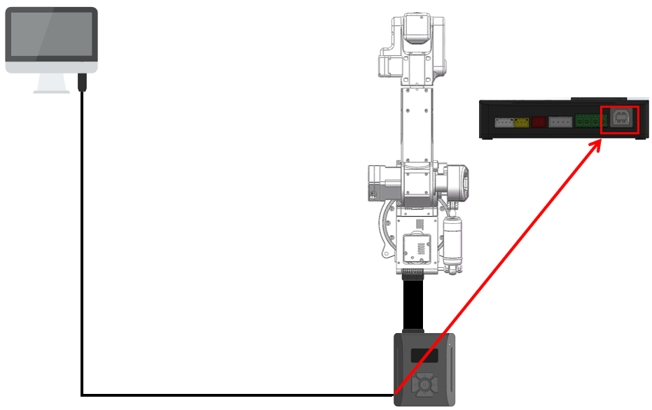

[EN](README.md)|[中文](README_zh-CN.md)|[한국어](README_ko-KR.md)

# WlkataC

#### wlkataC version 0.1.0

#### License: MIT

## IMPORTANT!!!

**&nbsp;&nbsp;&nbsp;&nbsp;This is a package that uses C++ to control Mirobot robotic arms, E4 robotic arms, MT4 robotic arms, sliders, conveyor belts, and other products. This package mainly communicates through serial and G-code protocols. Currently, it supports RS485 or UART communication. It should be noted that a multifunctional controller is required when using this software package, as some functions of the modified software package use a multifunctional controller. If the robotic arm is directly connected, some functions may be ineffective.**

## Description

**&nbsp;&nbsp;&nbsp;&nbsp;WlkataC is a C++package used to control Mirobot robotic arms, E4 robotic arms, MT4 robotic arms, slides, conveyors, and other products.**

**&nbsp;&nbsp;&nbsp;&nbsp;This component uses the G code protocol to communicate with the Mirobot over a serial connection.**

**&nbsp;&nbsp;&nbsp;&nbsp; The official G-code instruction set and drivers are available at the [WLkata Download Page](https://www.wlkata.com/pages/download-center).**

## Supported Devices

- Mirobot (UART/RS485)
- MT4 (UART/RS485)
- E4 (UART/RS485)
- Haro380 (UART/RS485)
- MS4220 stepper driver (RS485)

## Build & Dependencies

- Requirements:
  - CMake ≥ 3.22
  - C++23 compiler
  - Serial library embedded under `serial/` (no extra install)
- Windows links `SetupAPI` (already set in `CMakeLists.txt`).
- Linux: comment out the `SetupAPI` link line per hint in `CMakeLists.txt`.

Build example:

```bash
mkdir build && cd build
cmake ..
# Option A (portable):
cmake --build . -j
# Option B (Makefiles generator):
make -j
# Option C (Windows with VS generator):
# cmake --build . --config Release -j
```

Binary: `build/wlkata` (Windows: `wlkata.exe`).

## Serial & Address Notes

- Ports: Windows `COMx`, Linux `/dev/ttyUSBx` or `/dev/ttyACMx`
- Baudrate: RS485 examples use `38400`; UART examples use `115200`
- Addressing:
  - RS485 uses slave addresses (e.g., `1`, `2`, `10`)
  - Direct UART can use `-1` for direct-attach
  - `init(serial, addr, block_flag, message_flag)`:
    - `block_flag=true` makes common commands wait until Idle
    - `message_flag=true` prints low-level comm logs

## Mirobot Wiring diagram(RS485)

<div style="text-align: center;">
  
</div>

## Mirobot Example Usage(RS485)

```C++
#include <iostream>
#include <chrono>
#include <thread>
#include "serial/serial.h"
#include "wlkataC.h"

int main() {
    serial::Serial my_serial("com13", 38400);

    Mirobot_UART Mirobot;
    Mirobot_UART Mirobot_2;
    Mirobot.init(&my_serial, 1, true, true);
    Mirobot_2.init(&my_serial, 2, true, true);
    // Mirobot.message_print(true);
    // Mirobot_2.message_print(true);
    Mirobot.homing();
    Mirobot_2.homing();
    Mirobot_UART::CoordinateParams params;
    params.x = 255;
    params.y = 50;
    params.z = 200;
    params.a = 20;
    params.b = 0;
    params.c = 0;
    params.set_x = params.set_y = params.set_z = true;
    params.set_a = params.set_b = params.set_c = false;
    Mirobot.writecoordinate(0, 0, params);

    for (int i = 0; i < 5; i++) {
        Mirobot.writecoordinate(0, 0, 255, 0, 200, 0, 0, 0);
        Mirobot.writecoordinate(0, 0, 255, 0, 100, 0, 0, 0);
        Mirobot_2.writecoordinate(0, 0, 255, 0, 200, 0, 0, 0);
        Mirobot_2.writecoordinate(0, 0, 255, 0, 100, 0, 0, 0);
   
    }

    my_serial.close();
    // system("pause");
    return 0;
}
```

## Mirobot Wiring diagram(UART)

<div style="text-align: center;">
  
  
</div>

## Mirobot Example Usage(UART)

```C++
#include <iostream>
#include <chrono>
#include <thread>
#include "serial/serial.h"
#include "wlkataC.h"

int main() {
    serial::Serial my_serial("COM13", 115200);

    Mirobot_UART Mirobot;
    Mirobot.init(&my_serial, -1, true, true);
    // Mirobot.message_print(true);
    Mirobot.homing();
    Mirobot_UART::CoordinateParams params;
    params.x = 255;
    params.y = 50;
    params.z = 200;
    params.a = 20;
    params.b = 0;
    params.c = 0;
    params.set_x = params.set_y = params.set_z = true;
    params.set_a = params.set_b = params.set_c = false;
    Mirobot.writecoordinate(0, 0, params);

    for (int i = 0; i < 5; i++) {
        Mirobot.writecoordinate(0, 0, 255, 0, 200, 0, 0, 0);
        waitForIdle(Mirobot, "Waiting for run1...");

        Mirobot.writecoordinate(0, 0, 255, 0, 100, 0, 0, 0);
        waitForIdle(Mirobot, "Waiting for run2...");
    }

    my_serial.close();
    // system("pause");
    return 0;
}

```

## MT4 Wiring diagram(RS485)

<div style="text-align: center;">
  
</div>

## MT4 Example Usage(RS485)

```C++
#include <iostream>
#include <chrono>
#include <thread>
#include "serial/serial.h"
#include "wlkataC.h"

int main() {
    serial::Serial my_serial("com13", 38400);

    MT4_UART MT4_1;
    MT4_1.init(&my_serial, 1, true, true);
    // MT4_1.message_print(true);
    MT4_1.homing();
    MT4_UART::CoordinateParams params;
    params.x = 255;
    params.y = 50;
    params.z = 200;
    params.a = 20;
    params.set_x = params.set_y = params.set_z = true;
    params.set_a  = false;
    MT4_1.writecoordinate(0, 0, params);

    for (int i = 0; i < 5; i++) {

        MT4_1.writecoordinate(0, 0, 255, 0, 200, 0);
        waitForIdle(MT4_1, "Waiting for run1...");

        MT4_1.writecoordinate(0, 0, 255, 0, 100, 0);
        waitForIdle(MT4_1, "Waiting for run2...");

    }

    my_serial.close();
    // system("pause");
    return 0;
}

```

## MT4 Wiring diagram(UART)

<div style="text-align: center;">
  
</div>

## MT4 Example Usage(UART)

```C++
#include <iostream>
#include <chrono>
#include <thread>
#include "serial/serial.h"
#include "wlkataC.h"

int main() {
    serial::Serial my_serial("com13", 115200);

    MT4_UART MT4_1;
    MT4_1.init(&my_serial, -1, true, true);
    // MT4_1.message_print(true);
    MT4_1.homing();

    for (int i = 0; i < 5; i++) {
        MT4_1.writecoordinate(0, 0, 255, 0, 200, 0);
        waitForIdle(MT4_1, "Waiting for run1...");

        MT4_1.writecoordinate(0, 0, 255, 0, 100, 0);
        waitForIdle(MT4_1, "Waiting for run2...");
    }

    my_serial.close();
    // system("pause");
    return 0;
}
```

## MS4220 Wiring diagram(RS485)

<div style="text-align: center;">
  
</div>

## MS4220 Example Usage(RS485)

```C++
#include <iostream>
#include <chrono>
#include <thread>
#include "serial/serial.h"
#include "wlkataC.h"

int main() {
    serial::Serial my_serial("com13", 38400);

    MS4220_UART MS4220_1;
    MS4220_1.init(&my_serial, 10, true, true);
    for (int i = 0; i < 5; i++) {
        MS4220_1.move_speed(100);
        MS4220_1.move_speed(-100);
        MS4220_1.move_speed(0);
        }
    my_serial.close();
    // system("pause");
    return 0;
}
```

## Harobot Wiring diagram (UART)

<div style="text-align: center;">
  
  </div>

## Harobot Example Usage (UART)

```C++
#include <iostream>
#include <chrono>
#include <thread>
#include "serial/serial.h"
#include "wlkataC.h"

int main() {
    serial::Serial my_serial("COM4", 115200);

    Harobot_UART Harobot;
    Harobot.init(&my_serial, -1, true, true);
    Harobot.homing();

    for (int i = 0; i < 5; i++) {
        Harobot_UART::CoordinateParams params;
        params.x = 255;
        params.y = 50;
        params.z = 200;
        params.a = 20;
        params.set_x = params.set_y = params.set_z = true;
        Harobot.writecoordinate(0, 0, params);

        Harobot.writecoordinate(0, 0, 255, 0, 200, 0, 0, 0);
        Harobot.writecoordinate(0, 0, 255, 0, 100, 0, 0, 0);
    }

    my_serial.close();
    return 0;
}
```

## API Overview

- Base serial class: `UART`
  - `init(serial, addr, block_flag=false, message_flag=false)` (implemented by derived)
  - `message_print(bool)`, `block_flag(bool)`, `senMsg(string)`, `read_data()`
- Mirobot/Harobot: `Mirobot_UART`, `Harobot_UART`
  - Motion: `homing(int)`, `writecoordinate(...)`, `writeangle(...)`, `speed(int)`, `zero()`
  - Status: `getStatus()`, `getState()`, `getAngle(int)`, `getcoordinate(int)`
  - IO: `gpio_init()` and `gpio_*` functions
  - Others: `pump(int)`, `gripper(int)`, `restart()`, `runFile(string,bool)`
- MT4/E4: `MT4_UART`, `E4_UART` (4-axis variants)
- MS4220: `MS4220_UART` with `move_position(...)`, `move_speed(int)`

## API Reference (Tables)

### UART

| Method | Signature | Notes |
| - | - | - |
| message_print | `void message_print(bool enable=false)` | Print low-level logs |
| block_flag | `void block_flag(bool enable=false)` | Enable blocking behavior |
| senMsg | `void senMsg(std::string data)` | Send raw command |
| read_data | `void read_data()` | Read raw data |

### Mirobot_UART / Harobot_UART (6-axis)

| Category | Method/Struct | Signature | Notes |
| - | - | - | - |
| Init | init | `void init(serial::Serial*,int,bool,bool)` | `-1` for direct UART; RS485 uses slave addr |
| Motion | homing | `void homing(int mode=8)` | Homing |
| Motion | writecoordinate | `void writecoordinate(int,int,float,float,float,float,float,float)` | Pos (args) |
| Motion | CoordinateParams | `{x,y,z,a,b,c; set_x..set_c}` | Set only needed coords |
| Motion | writecoordinate | `void writecoordinate(int,int,const CoordinateParams&)` | Pos (struct) |
| Motion | writeangle | `void writeangle(int,float,float,float,float,float,float)` | Angles (args) |
| Motion | AngleParams | `{x,y,z,a,b,c; set_x..set_c}` | Angle flags |
| Motion | writeangle | `void writeangle(int,const AngleParams&)` | Angles (struct) |
| Motion | speed | `void speed(int v)` | Device-defined |
| Other | zero | `void zero()` | Zero |
| Other | pump/gripper | `void pump(int)` / `void gripper(int)` | Actuators |
| Other | restart/runFile | `void restart()` / `void runFile(std::string,bool)` | Reboot/run file |
| Status | getStatus/getState | `datas getStatus()` / `std::string getState()` | Status |
| Status | getAngle/getcoordinate | `float getAngle(int)` / `float getcoordinate(int)` | Single field |
| IO | gpio_* | `gpio_init/mode/output/input/enable/threshold` | GPIO |

### MT4_UART / E4_UART (4-axis)

| Category | Method/Struct | Signature | Notes |
| - | - | - | - |
| Init | init | `void init(serial::Serial*,int,bool,bool)` | Same as above |
| Motion | writecoordinate | `void writecoordinate(int,int,float,float,float,float)` | Pos (args) |
| Motion | CoordinateParams | `{x,y,z,a; set_x..set_a}` | Pos (struct) |
| Motion | writecoordinate | `void writecoordinate(int,int,const CoordinateParams&)` | Pos (struct) |
| Motion | writeangle | `void writeangle(int,float,float,float,float)` | Angles (args) |
| Motion | AngleParams | `{x,y,z,a; set_x..set_a}` | Angle (struct) |
| Motion | writeangle | `void writeangle(int,const AngleParams&)` | Angles (struct) |
| Motion | homing/zero | `void homing(int)` / `void zero()` | Homing/zero |
| Status | getAngle/getcoordinate | `float getAngle(int)` / `float getcoordinate(int)` | Single field |

### MS4220_UART

| Category | Method | Signature | Notes |
| - | - | - | - |
| Init | init | `void init(serial::Serial*,int,bool,bool)` | RS485 slave addr required |
| Control | restart/homing | `void restart()` / `void homing()` | Control |
| Control | move_position | `void move_position(int,int,int)` | Position/steps/speed |
| Control | move_speed | `void move_speed(int)` | Velocity mode |
| Status | get_Status/get_State | `datas get_Status()` / `std::string get_State()` | Status |
| Status | get_position/get_sensor | `int get_position()` / `int get_sensor(std::string)` | Position/sensor |

## Minimal Runnable Examples

### Mirobot (UART direct)

```C++
#include <chrono>
#include <thread>
#include "serial/serial.h"
#include "wlkataC.h"

int main() {
    serial::Serial serial("COM13", 115200);
    Mirobot_UART bot;
    bot.init(&serial, -1, true, true);
    bot.homing();
    Mirobot_UART::CoordinateParams p; 
    p.x=200; p.z=150; p.set_x=p.set_z=true;
    bot.writecoordinate(0, 0, p);
    serial.close();
}
```

### MS4220 (RS485, addr 10)

```C++
#include <chrono>
#include <thread>
#include "serial/serial.h"
#include "wlkataC.h"

int main() {
    serial::Serial serial("COM13", 38400);
    MS4220_UART drv; 
    drv.init(&serial, 10, true, true);
    drv.homing();
    drv.move_speed(100);
    drv.move_speed(0);
    serial.close();
}
```

## Changelog

Follows Keep a Changelog and SemVer.

### [0.1.0] - 2025-10-30
- Support basic control for Mirobot, MT4, E4, Haro380, MS4220.
- Provide RS485 and UART examples.

## Communication

For further instructions, contact WLkata personnel at the [WLkata Download Page](https://www.wlkata.com/pages/download-center).

