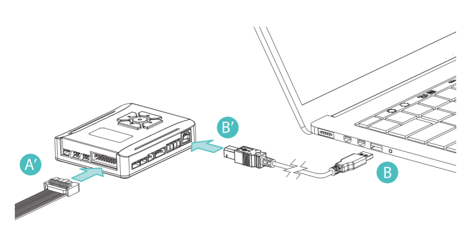
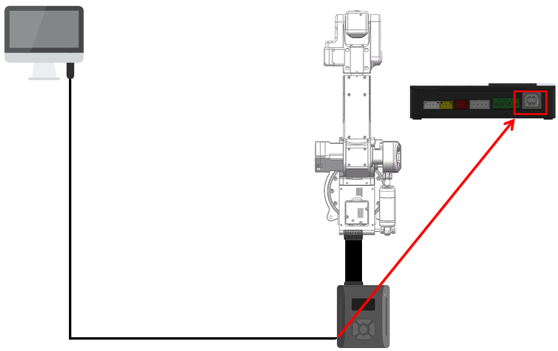

### [EN](README.md)|[中文](README_zh-CN.md)|[한국어](README_ko-KR.md)


# WlkataC

#### wlkataC 버전 0.1.0

#### 라이선스: MIT

## 중요!!!

**&nbsp;&nbsp;&nbsp;&nbsp;이 패키지는 C++를 사용하여 Mirobot 로봇 팔, E4 로봇 팔, MT4 로봇 팔, 슬라이더, 컨베이어 벨트 및 기타 제품을 제어하는 패키지입니다. 이 패키지는 주로 시리얼 및 G 코드 프로토콜을 통해 통신합니다. 현재 RS485 또는 UART 통신을 지원합니다. 이 소프트웨어 패키지를 사용할 때는 다기능 컨트롤러가 필요합니다. 수정된 소프트웨어 패키지의 일부 기능은 다기능 컨트롤러를 사용하기 때문입니다. 로봇 팔을 직접 연결할 경우 일부 기능이 작동하지 않을 수 있습니다.**

## 설명

**&nbsp;&nbsp;&nbsp;&nbsp;WlkataC는 Mirobot 로봇 팔, E4 로봇 팔, MT4 로봇 팔, 슬라이드, 컨베이어 및 기타 제품을 제어하는 C++ 패키지입니다.**

**&nbsp;&nbsp;&nbsp;&nbsp;이 구성 요소는 시리얼 연결을 통해 Mirobot과 통신하기 위해 G 코드 프로토콜을 사용합니다.**

**&nbsp;&nbsp;&nbsp;&nbsp;공식 G-code 명령 세트와 드라이버는 [WLkata 다운로드 페이지](https://www.wlkata.com/pages/download-center)에서 받을 수 있습니다.**

## 지원 장치

- Mirobot (UART/RS485)
- MT4 (UART/RS485)
- E4 (UART/RS485)
- Haro380 (UART/RS485)
- MS4220 스테퍼 드라이버 (RS485)

## 빌드 및 의존성

- 요구 사항:
  - CMake ≥ 3.22
  - C++23 컴파일러
  - 시리얼 라이브러리(`serial/`) 포함됨
- Windows: `SetupAPI` 링크 필요(`CMakeLists.txt`에 설정됨)
- Linux: `SetupAPI` 링크 라인 주석 처리(파일 내 안내 참조)

빌드 예시:

```bash
mkdir build && cd build
cmake ..
# 옵션 A(이식성 좋음):
cmake --build . -j
# 옵션 B(Makefiles 제너레이터 사용 시):
make -j
# 옵션 C(Windows, VS 제너레이터):
# cmake --build . --config Release -j
```

생성 바이너리: `build/wlkata` (Windows: `wlkata.exe`).

## 시리얼 및 주소 안내

- 포트: Windows `COMx`, Linux `/dev/ttyUSBx`, `/dev/ttyACMx`
- 보드레이트: RS485 `38400`, UART `115200`
- 주소:
  - RS485는 슬레이브 주소 사용(예: `1`, `2`, `10`)
  - UART 직결은 `-1` 사용 가능
  - `init(serial, addr, block_flag, message_flag)`:
    - `block_flag=true` 공통 명령이 Idle까지 대기
    - `message_flag=true` 저수준 로그 출력

## Mirobot 배선도(RS485)

<div style="text-align: center;">
  
</div>

## Mirobot 예제 사용법(RS485)

```C++
#include <iostream>
#include <chrono>
#include <thread>
#include "serial/serial.h"
#include "wlkataC.h"

int main() {
    serial::Serial my_serial("com13", 38400);

    Mirobot_UART Mirobot;
    Mirobot_UART Mirobot_2;
    Mirobot.init(&my_serial, 1, true, true);
    Mirobot_2.init(&my_serial, 2, true, true);
    // Mirobot.message_print(true);
    // Mirobot_2.message_print(true);
    Mirobot.homing();
    Mirobot_2.homing();
    Mirobot_UART::CoordinateParams params;
    params.x=255; params.y=50; params.z=200; params.a=20; params.b=0; params.c=0;
    params.set_x=params.set_y=params.set_z=true; params.set_a=params.set_b=params.set_c=false;
    Mirobot.writecoordinate(0, 0, params);

    for (int i = 0; i < 5; i++) {
        Mirobot.writecoordinate(0, 0, 255, 0, 200, 0, 0, 0);
        Mirobot.writecoordinate(0, 0, 255, 0, 100, 0, 0, 0);
        Mirobot_2.writecoordinate(0, 0, 255, 0, 200, 0, 0, 0);
        Mirobot_2.writecoordinate(0, 0, 255, 0, 100, 0, 0, 0);
   
    }

    my_serial.close();
    // system("pause");
    return 0;
}
```


## Mirobot 배선도(UART)

<div style="text-align: center;">
  
  
</div>

## Mirobot 예제 사용법(UART)

```C++
#include <iostream>
#include <chrono>
#include <thread>
#include "serial/serial.h"
#include "wlkataC.h"

int main() {
    serial::Serial my_serial("COM13", 115200);

    Mirobot_UART Mirobot;
    Mirobot.init(&my_serial, -1, true, true);
    // Mirobot.message_print(true);
    Mirobot.homing();
    Mirobot_UART::CoordinateParams params;
    params.x=255; params.y=50; params.z=200; params.a=20; params.b=0; params.c=0;
    params.set_x=params.set_y=params.set_z=true; params.set_a=params.set_b=params.set_c=false;
    Mirobot.writecoordinate(0, 0, params);

    for (int i = 0; i < 5; i++) {
        Mirobot.writecoordinate(0, 0, 255, 0, 200, 0, 0, 0);
        waitForIdle(Mirobot, "Waiting for run1...");

        Mirobot.writecoordinate(0, 0, 255, 0, 100, 0, 0, 0);
        waitForIdle(Mirobot, "Waiting for run2...");
    }

    my_serial.close();
    // system("pause");
    return 0;
}
```

## MT4 배선도(RS485)

<div style="text-align: center;">
  
</div>

## MT4 예제 사용법(RS485)

```C++
#include <iostream>
#include <chrono>
#include <thread>
#include "serial/serial.h"
#include "wlkataC.h"

int main() {
    serial::Serial my_serial("com13", 38400);

    MT4_UART MT4_1;
    MT4_1.init(&my_serial, 1, true, true);
    // MT4_1.message_print(true);
    MT4_1.homing();
    MT4_UART::CoordinateParams params;
    params.x=255; params.y=50; params.z=200; params.a=20;
    params.set_x=params.set_y=params.set_z=true; params.set_a=false;
    MT4_1.writecoordinate(0, 0, params);

    for (int i = 0; i < 5; i++) {

        MT4_1.writecoordinate(0, 0, 255, 0, 200, 0);
        waitForIdle(MT4_1, "Waiting for run1...");

        MT4_1.writecoordinate(0, 0, 255, 0, 100, 0);
        waitForIdle(MT4_1, "Waiting for run2...");

    }

    my_serial.close();
    // system("pause");
    return 0;
}
```

## MT4 배선도(UART)

<div style="text-align: center;">
  
</div>

## MT4 예제 사용법(UART)

```C++
#include <iostream>
#include <chrono>
#include <thread>
#include "serial/serial.h"
#include "wlkataC.h"

int main() {
    serial::Serial my_serial("com13", 115200);

    MT4_UART MT4_1;
    MT4_1.init(&my_serial, -1, true, true);
    // MT4_1.message_print(true);
    MT4_1.homing();

    for (int i = 0; i < 5; i++) {
        MT4_1.writecoordinate(0, 0, 255, 0, 200, 0);
        waitForIdle(MT4_1, "Waiting for run1...");

        MT4_1.writecoordinate(0, 0, 255, 0, 100, 0);
        waitForIdle(MT4_1, "Waiting for run2...");
    }

    my_serial.close();
    // system("pause");
    return 0;
}
```

## MS4220 배선도(RS485)

<div style="text-align: center;">
  
</div>

## MS4220 예제 사용법(RS485)

```C++
#include <iostream>
#include <chrono>
#include <thread>
#include "serial/serial.h"
#include "wlkataC.h"

int main() {
    serial::Serial my_serial("com13", 38400);

    MS4220_UART MS4220_1;
    MS4220_1.init(&my_serial, 10, true, true);
    for (int i = 0; i < 5; i++) {
        MS4220_1.move_speed(100);
        MS4220_1.move_speed(-100);
        MS4220_1.move_speed(0);
        }
    my_serial.close();
    // system("pause");
    return 0;
}
```

## Harobot 배선도(UART)

<div style="text-align: center;">
  
</div>

## Harobot 예제 사용법(UART)

```C++
#include <iostream>
#include <chrono>
#include <thread>
#include "serial/serial.h"
#include "wlkataC.h"

int main() {
    serial::Serial my_serial("COM4", 115200);

    Harobot_UART Harobot;
    Harobot.init(&my_serial, -1, true, true);
    Harobot.homing();

    for (int i = 0; i < 5; i++) {
        Harobot_UART::CoordinateParams params;
        params.x = 255;
        params.y = 50;
        params.z = 200;
        params.a = 20;
        params.set_x = params.set_y = params.set_z = true;
        Harobot.writecoordinate(0, 0, params);

        Harobot.writecoordinate(0, 0, 255, 0, 200, 0, 0, 0);
        Harobot.writecoordinate(0, 0, 255, 0, 100, 0, 0, 0);
    }

    my_serial.close();
    return 0;
}
```

## API 개요

- 기본 시리얼 클래스: `UART`
  - 파생 클래스가 `init` 구현
  - `message_print(bool)`, `block_flag(bool)`, `senMsg(string)`, `read_data()`
- Mirobot/Harobot: `Mirobot_UART`, `Harobot_UART`
  - 동작: `homing(int)`, `writecoordinate(...)`, `writeangle(...)`, `speed(int)`, `zero()`
  - 상태: `getStatus()`, `getState()`, `getAngle(int)`, `getcoordinate(int)`
  - IO: `gpio_init()` 및 `gpio_*`
  - 기타: `pump(int)`, `gripper(int)`, `restart()`, `runFile(string,bool)`
- MT4/E4: `MT4_UART`, `E4_UART` (4축)
- MS4220: `MS4220_UART` (`move_position(...)`, `move_speed(int)`)

## API 참고 (표)

### UART

| 메서드 | 시그니처 | 설명 |
| - | - | - |
| message_print | `void message_print(bool enable=false)` | 저수준 로그 출력 |
| block_flag | `void block_flag(bool enable=false)` | 블로킹 동작 설정 |
| senMsg | `void senMsg(std::string data)` | 원시 명령 전송 |
| read_data | `void read_data()` | 원시 데이터 읽기 |

### Mirobot_UART / Harobot_UART (6축)

| 구분 | 메서드/구조체 | 시그니처 | 설명 |
| - | - | - | - |
| 초기화 | init | `void init(serial::Serial*,int,bool,bool)` | UART 직결 `-1`, RS485 슬레이브 주소 |
| 동작 | homing | `void homing(int mode=8)` | 원점 복귀 |
| 동작 | writecoordinate | `void writecoordinate(int,int,float,float,float,float,float,float)` | 위치(인자) |
| 동작 | CoordinateParams | `{x,y,z,a,b,c; set_x..set_c}` | 필요한 좌표만 설정 |
| 동작 | writecoordinate | `void writecoordinate(int,int,const CoordinateParams&)` | 위치(구조체) |
| 동작 | writeangle | `void writeangle(int,float,float,float,float,float,float)` | 각도(인자) |
| 동작 | AngleParams | `{x,y,z,a,b,c; set_x..set_c}` | 각도 플래그 |
| 동작 | writeangle | `void writeangle(int,const AngleParams&)` | 각도(구조체) |
| 동작 | speed | `void speed(int v)` | 장치 정의 |
| 기타 | zero | `void zero()` | 영점 |
| 기타 | pump/gripper | `void pump(int)` / `void gripper(int)` | 액추에이터 |
| 기타 | restart/runFile | `void restart()` / `void runFile(std::string,bool)` | 재부팅/파일 실행 |
| 상태 | getStatus/getState | `datas getStatus()` / `std::string getState()` | 상태 |
| 상태 | getAngle/getcoordinate | `float getAngle(int)` / `float getcoordinate(int)` | 단일 필드 |
| IO | gpio_* | `gpio_init/mode/output/input/enable/threshold` | GPIO |

### MT4_UART / E4_UART (4축)

| 구분 | 메서드/구조체 | 시그니처 | 설명 |
| - | - | - | - |
| 초기화 | init | `void init(serial::Serial*,int,bool,bool)` | 동일 |
| 동작 | writecoordinate | `void writecoordinate(int,int,float,float,float,float)` | 위치(인자) |
| 동작 | CoordinateParams | `{x,y,z,a; set_x..set_a}` | 위치(구조체) |
| 동작 | writecoordinate | `void writecoordinate(int,int,const CoordinateParams&)` | 위치(구조체) |
| 동작 | writeangle | `void writeangle(int,float,float,float,float)` | 각도(인자) |
| 동작 | AngleParams | `{x,y,z,a; set_x..set_a}` | 각도(구조체) |
| 동작 | writeangle | `void writeangle(int,const AngleParams&)` | 각도(구조체) |
| 동작 | homing/zero | `void homing(int)` / `void zero()` | 원점/영점 |
| 상태 | getAngle/getcoordinate | `float getAngle(int)` / `float getcoordinate(int)` | 단일 필드 |

### MS4220_UART

| 구분 | 메서드 | 시그니처 | 설명 |
| - | - | - | - |
| 초기화 | init | `void init(serial::Serial*,int,bool,bool)` | RS485 슬레이브 주소 필요 |
| 제어 | restart/homing | `void restart()` / `void homing()` | 제어 |
| 제어 | move_position | `void move_position(int,int,int)` | 위치/스텝/속도 |
| 제어 | move_speed | `void move_speed(int)` | 속도 모드 |
| 상태 | get_Status/get_State | `datas get_Status()` / `std::string get_State()` | 상태 |
| 상태 | get_position/get_sensor | `int get_position()` / `int get_sensor(std::string)` | 위치/센서 |

## 최소 실행 예제

### Mirobot (UART 직결)

```C++
#include <chrono>
#include <thread>
#include "serial/serial.h"
#include "wlkataC.h"

int main() {
    serial::Serial serial("COM13", 115200);
    Mirobot_UART bot;
    bot.init(&serial, -1, true, true);
    bot.homing();
    Mirobot_UART::CoordinateParams p; 
    p.x=200; p.z=150; p.set_x=p.set_z=true;
    bot.writecoordinate(0, 0, p);
    serial.close();
}
```

### MS4220 (RS485, 주소 10)

```C++
#include <chrono>
#include <thread>
#include "serial/serial.h"
#include "wlkataC.h"

int main() {
    serial::Serial serial("COM13", 38400);
    MS4220_UART drv; 
    drv.init(&serial, 10, true, true);
    drv.homing();
    drv.move_speed(100);
    drv.move_speed(0);
    serial.close();
}
```

## 변경 로그

Keep a Changelog / SemVer 준수.

### [0.1.0] - 2025-10-30
- Mirobot, MT4, E4, Haro380, MS4220 기본 제어 지원.
- RS485/UART 예제 제공.

### [Unreleased]
- 문서: API 표, 최소 예제 추가, 시리얼/주소 안내 정리.
- 문서: 예제 개선 및 국제화 가독성 향상.

## 통신 안내

추가 지침은 [WLkata 다운로드 페이지](https://www.wlkata.com/pages/download-center)를 참고하거나 담당자에게 문의하세요.