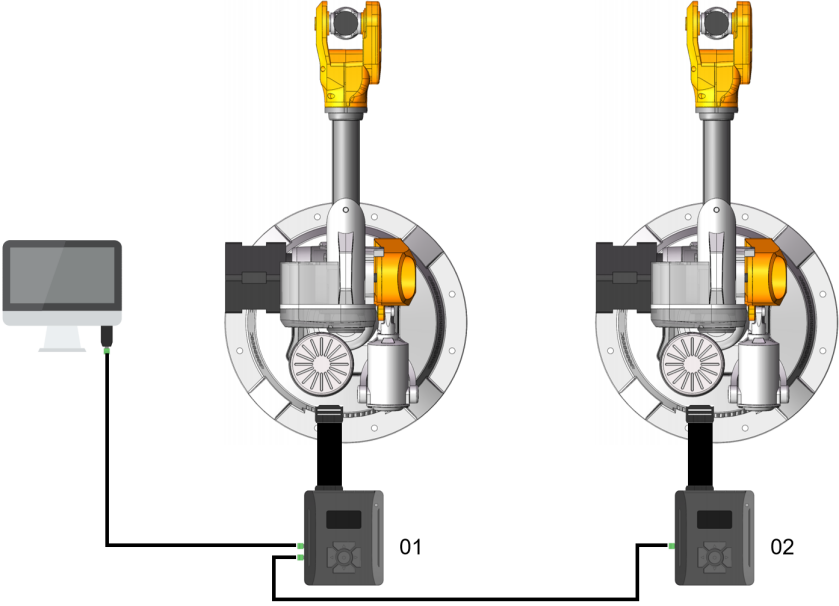

### [EN](README.md)|[中文](README_zh-CN.md)|[한국어](README_ko-KR.md)


# WlkataC

#### wlkataC 버전 0.0.1

#### 라이선스: MIT

## 중요!!!

**&nbsp;&nbsp;&nbsp;&nbsp;이 패키지는 C++를 사용하여 Mirobot 로봇 팔, E4 로봇 팔, MT4 로봇 팔, 슬라이더, 컨베이어 벨트 및 기타 제품을 제어하는 패키지입니다. 이 패키지는 주로 시리얼 및 G 코드 프로토콜을 통해 통신합니다. 현재 RS485 또는 UART 통신을 지원합니다. 이 소프트웨어 패키지를 사용할 때는 다기능 컨트롤러가 필요합니다. 수정된 소프트웨어 패키지의 일부 기능은 다기능 컨트롤러를 사용하기 때문입니다. 로봇 팔을 직접 연결할 경우 일부 기능이 작동하지 않을 수 있습니다.**

## 설명

**&nbsp;&nbsp;&nbsp;&nbsp;WlkataC는 Mirobot 로봇 팔, E4 로봇 팔, MT4 로봇 팔, 슬라이드, 컨베이어 및 기타 제품을 제어하는 C++ 패키지입니다.**

**&nbsp;&nbsp;&nbsp;&nbsp;이 구성 요소는 시리얼 연결을 통해 Mirobot과 통신하기 위해 G 코드 프로토콜을 사용합니다.**

**&nbsp;&nbsp;&nbsp;&nbsp;공식 G 코드 명령 세트 및 드라이버 다운로드는 [WLkata 다운로드 페이지](https://www.wlkata.com/pages/download-center)에서 찾을 수 있습니다.**

## Mirobot 배선도(RS485)

<div style="text-align: center;">
  
</div>

## Mirobot 예제 사용법(RS485)

```C++
#include <iostream>
#include <chrono>
#include <thread>
#include "serial/serial.h"
#include "wlkataC.h"

void waitForIdle(Mirobot_UART &Mirobot, const std::string &message) {
    while (Mirobot.getState() != "Idle") {
        std::cout << message << std::endl;
        std::this_thread::sleep_for(std::chrono::milliseconds(500));
    }
}

int main() {
    serial::Serial my_serial("com13", 38400);

    Mirobot_UART Mirobot;
    Mirobot_UART Mirobot_2;
    Mirobot.init(&my_serial, 1);
    Mirobot_2.init(&my_serial, 2);
    // Mirobot.message_print(true);
    // Mirobot_2.message_print(true);

    Mirobot.restart();
    Mirobot_2.restart();
    std::this_thread::sleep_for(std::chrono::milliseconds(2000));
    Mirobot.homing();
    Mirobot_2.homing();
    waitForIdle(Mirobot, "Homing...");
    waitForIdle(Mirobot_2, "Homing...");

    for (int i = 0; i < 5; i++) {
        Mirobot.writecoordinate(0, 0, 255, 0, 200, 0, 0, 0);
        waitForIdle(Mirobot, "Waiting for run1...");
   
        Mirobot.writecoordinate(0, 0, 255, 0, 100, 0, 0, 0);
        waitForIdle(Mirobot, "Waiting for run2...");

        Mirobot_2.writecoordinate(0, 0, 255, 0, 200, 0, 0, 0);
        waitForIdle(Mirobot_2, "Waiting for run3...");

        Mirobot_2.writecoordinate(0, 0, 255, 0, 100, 0, 0, 0);
        waitForIdle(Mirobot_2, "Waiting for run4...");
   
    }

    my_serial.close();
    // system("pause");
    return 0;
}
```

## Mirobot 배선도(UART)

<div style="text-align: center;">
  
  
</div>

## Mirobot 예제 사용법(UART)

```C++
#include <iostream>
#include <chrono>
#include <thread>
#include "serial/serial.h"
#include "wlkataC.h"

void waitForIdle(Mirobot_UART &Mirobot, const std::string &message) {
    while (Mirobot.getState() != "Idle") {
        std::cout << message << std::endl;
        std::this_thread::sleep_for(std::chrono::milliseconds(500));
    }
}

int main() {
    serial::Serial my_serial("com13", 115200);

    Mirobot_UART Mirobot;
    Mirobot.init(&my_serial, -1);
    // Mirobot.message_print(true);

    Mirobot.restart();
    std::this_thread::sleep_for(std::chrono::milliseconds(2000));
    Mirobot.homing();
    waitForIdle(Mirobot, "Homing...");

    for (int i = 0; i < 5; i++) {
        Mirobot.writecoordinate(0, 0, 255, 0, 200, 0, 0, 0);
        waitForIdle(Mirobot, "Waiting for run1...");

        Mirobot.writecoordinate(0, 0, 255, 0, 100, 0, 0, 0);
        waitForIdle(Mirobot, "Waiting for run2...");
    }

    my_serial.close();
    // system("pause");
    return 0;
}
```

## MT4 배선도(RS485)

<div style="text-align: center;">
  
</div>

## MT4 예제 사용법(RS485)

```C++
#include <iostream>
#include <chrono>
#include <thread>
#include "serial/serial.h"
#include "wlkataC.h"

void waitForIdle(MT4_UART &MT4_1, const std::string &message) {
    while (MT4_1.getState() != "Idle") {
        std::cout << message << std::endl;
        std::this_thread::sleep_for(std::chrono::milliseconds(2000));
    }
}

int main() {
    serial::Serial my_serial("com13", 38400);

    MT4_UART MT4_1;
    MT4_1.init(&my_serial, 1);
    // MT4_1.message_print(true);

    MT4_1.restart();
    std::this_thread::sleep_for(std::chrono::milliseconds(2000));
    MT4_1.homing();
    waitForIdle(MT4_1, "Homing...");

    for (int i = 0; i < 5; i++) {

        MT4_1.writecoordinate(0, 0, 255, 0, 200, 0);
        waitForIdle(MT4_1, "Waiting for run1...");

        MT4_1.writecoordinate(0, 0, 255, 0, 100, 0);
        waitForIdle(MT4_1, "Waiting for run2...");

    }

    my_serial.close();
    // system("pause");
    return 0;
}
```

## MT4 배선도(UART)

<div style="text-align: center;">
  
</div>

## MT4 예제 사용법(UART)

```C++
#include <iostream>
#include <chrono>
#include <thread>
#include "serial/serial.h"
#include "wlkataC.h"

void waitForIdle(MT4_UART &MT4_1, const std::string &message) {
    while (MT4_1.getState() != "Idle") {
        std::cout << message << std::endl;
        std::this_thread::sleep_for(std::chrono::milliseconds(2000));
    }
}

int main() {
    serial::Serial my_serial("com13", 115200);

    MT4_UART MT4_1;
    MT4_1.init(&my_serial, -1);
    // MT4_1.message_print(true);

    MT4_1.restart();
    std::this_thread::sleep_for(std::chrono::milliseconds(2000));
    MT4_1.homing();
    waitForIdle(MT4_1, "Homing...");

    for (int i = 0; i < 5; i++) {
        MT4_1.writecoordinate(0, 0, 255, 0, 200, 0);
        waitForIdle(MT4_1, "Waiting for run1...");

        MT4_1.writecoordinate(0, 0, 255, 0, 100, 0);
        waitForIdle(MT4_1, "Waiting for run2...");
    }

    my_serial.close();
    // system("pause");
    return 0;
}
```

## MS4220 배선도(RS485)

<div style="text-align: center;">
  
</div>

## MS4220 예제 사용법(RS485)

```C++
#include <iostream>
#include <chrono>
#include <thread>
#include "serial/serial.h"
#include "wlkataC.h"

int main() {
    serial::Serial my_serial("com13", 115200);

    MS4220_UART MS4220_1;
    MS4220_1.init(&my_serial, -1);
    for (int i = 0; i < 5; i++) {
        MS4220_1.speed(100);
        std::this_thread::sleep_for(std::chrono::milliseconds(5000));
        MS4220_1.speed(-100);
        std::this_thread::sleep_for(std::chrono::milliseconds(5000));
        MS4220_1.speed(0);
        std::this_thread::sleep_for(std::chrono::milliseconds(5000));
        }
    my_serial.close();
    // system("pause");
    return 0;
}
```

## 통신 방법

**&nbsp;&nbsp;&nbsp;&nbsp;추가 지침은 [WLkata 다운로드 페이지](https://www.wlkata.com/pages/download-center)에서 Wlkata 담당자에게 문의하십시오.**