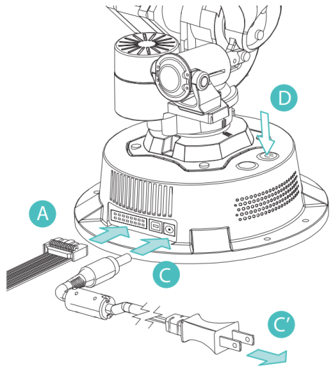

[EN](README.md)|[中文](README_zh-CN.md)|[한국어](README_ko-KR.md)

# WlkataC

#### wlkataC 版本 0.0.1

#### 许可证: MIT

## 重要提示!!!

**&nbsp;&nbsp;&nbsp;&nbsp;这是一个使用 C++ 控制 Mirobot 机械臂、E4 机械臂、MT4 机械臂、滑块、传送带及其他产品的软件包。该软件包主要通过串口和 G 代码协议进行通信。目前支持 RS485 或 UART 通信。需要注意的是，使用此软件包时需要一个多功能控制器，因为修改后的软件包中的某些功能需要使用多功能控制器。如果直接连接机械臂，某些功能可能无效。**

## 描述

**&nbsp;&nbsp;&nbsp;&nbsp;WlkataC 是一个用于控制 Mirobot 机械臂、E4 机械臂、MT4 机械臂、滑块、传送带及其他产品的 C++ 软件包。**

**&nbsp;&nbsp;&nbsp;&nbsp;该组件使用 G 代码协议通过串口与 Mirobot 进行通信。**

**&nbsp;&nbsp;&nbsp;&nbsp;官方 G 代码指令集和驱动程序下载可以在 [WLkata 下载页面](https://cn.wlkata.com/cn_downloads_wlkata.php) 找到。**

## Mirobot 接线图 (RS485)

<div style="text-align: center;">
  
</div>

## Mirobot 示例用法 (RS485)

```C++
#include <iostream>
#include <chrono>
#include <thread>
#include "serial/serial.h"
#include "wlkataC.h"

void waitForIdle(Mirobot_UART &Mirobot, const std::string &message) {
    while (Mirobot.getState() != "Idle") {
        std::cout << message << std::endl;
        std::this_thread::sleep_for(std::chrono::milliseconds(500));
    }
}

int main() {
    serial::Serial my_serial("com13", 38400);

    Mirobot_UART Mirobot;
    Mirobot_UART Mirobot_2;
    Mirobot.init(&my_serial, 1);
    Mirobot_2.init(&my_serial, 2);
    // Mirobot.message_print(true);
    // Mirobot_2.message_print(true);

    Mirobot.restart();
    Mirobot_2.restart();
    std::this_thread::sleep_for(std::chrono::milliseconds(2000));
    Mirobot.homing();
    Mirobot_2.homing();
    waitForIdle(Mirobot, "归位中...");
    waitForIdle(Mirobot_2, "归位中...");

    for (int i = 0; i < 5; i++) {
        Mirobot.writecoordinate(0, 0, 255, 0, 200, 0, 0, 0);
        waitForIdle(Mirobot, "等待运行1...");
     
        Mirobot.writecoordinate(0, 0, 255, 0, 100, 0, 0, 0);
        waitForIdle(Mirobot, "等待运行2...");

        Mirobot_2.writecoordinate(0, 0, 255, 0, 200, 0, 0, 0);
        waitForIdle(Mirobot_2, "等待运行3...");

        Mirobot_2.writecoordinate(0, 0, 255, 0, 100, 0, 0, 0);
        waitForIdle(Mirobot_2, "等待运行4...");
   
    }

    my_serial.close();
    // system("pause");
    return 0;
}
```

## Mirobot 接线图 (UART)

<div style="text-align: center;">
  
  
</div>

## Mirobot 示例用法 (UART)

```C++
#include <iostream>
#include <chrono>
#include <thread>
#include "serial/serial.h"
#include "wlkataC.h"

void waitForIdle(Mirobot_UART &Mirobot, const std::string &message) {
    while (Mirobot.getState() != "Idle") {
        std::cout << message << std::endl;
        std::this_thread::sleep_for(std::chrono::milliseconds(500));
    }
}

int main() {
    serial::Serial my_serial("com13", 115200);

    Mirobot_UART Mirobot;
    Mirobot.init(&my_serial, -1);
    // Mirobot.message_print(true);

    Mirobot.restart();
    std::this_thread::sleep_for(std::chrono::milliseconds(2000));
    Mirobot.homing();
    waitForIdle(Mirobot, "归位中...");

    for (int i = 0; i < 5; i++) {
        Mirobot.writecoordinate(0, 0, 255, 0, 200, 0, 0, 0);
        waitForIdle(Mirobot, "等待运行1...");

        Mirobot.writecoordinate(0, 0, 255, 0, 100, 0, 0, 0);
        waitForIdle(Mirobot, "等待运行2...");
    }

    my_serial.close();
    // system("pause");
    return 0;
}
```

## MT4 接线图 (RS485)

<div style="text-align: center;">
  
</div>

## MT4 示例用法 (RS485)

```C++
#include <iostream>
#include <chrono>
#include <thread>
#include "serial/serial.h"
#include "wlkataC.h"

void waitForIdle(MT4_UART &MT4_1, const std::string &message) {
    while (MT4_1.getState() != "Idle") {
        std::cout << message << std::endl;
        std::this_thread::sleep_for(std::chrono::milliseconds(2000));
    }
}

int main() {
    serial::Serial my_serial("com13", 38400);

    MT4_UART MT4_1;
    MT4_1.init(&my_serial, 1);
    // MT4_1.message_print(true);

    MT4_1.restart();
    std::this_thread::sleep_for(std::chrono::milliseconds(2000));
    MT4_1.homing();
    waitForIdle(MT4_1, "归位中...");

    for (int i = 0; i < 5; i++) {

        MT4_1.writecoordinate(0, 0, 255, 0, 200, 0);
        waitForIdle(MT4_1, "等待运行1...");

        MT4_1.writecoordinate(0, 0, 255, 0, 100, 0);
        waitForIdle(MT4_1, "等待运行2...");

    }

    my_serial.close();
    // system("pause");
    return 0;
}
```

## MT4 接线图 (UART)

<div style="text-align: center;">
  
</div>

## MT4 示例用法 (UART)

```C++
#include <iostream>
#include <chrono>
#include <thread>
#include "serial/serial.h"
#include "wlkataC.h"

void waitForIdle(MT4_UART &MT4_1, const std::string &message) {
    while (MT4_1.getState() != "Idle") {
        std::cout << message << std::endl;
        std::this_thread::sleep_for(std::chrono::milliseconds(2000));
    }
}

int main() {
    serial::Serial my_serial("com13", 115200);

    MT4_UART MT4_1;
    MT4_1.init(&my_serial, -1);
    // MT4_1.message_print(true);

    MT4_1.restart();
    std::this_thread::sleep_for(std::chrono::milliseconds(2000));
    MT4_1.homing();
    waitForIdle(MT4_1, "归位中...");

    for (int i = 0; i < 5; i++) {
        MT4_1.writecoordinate(0, 0, 255, 0, 200, 0);
        waitForIdle(MT4_1, "等待运行1...");

        MT4_1.writecoordinate(0, 0, 255, 0, 100, 0);
        waitForIdle(MT4_1, "等待运行2...");
    }

    my_serial.close();
    // system("pause");
    return 0;
}
```

## MS4220 接线图 (RS485)

<div style="text-align: center;">
  
</div>

## MS4220 示例用法 (RS485)

```C++
#include <iostream>
#include <chrono>
#include <thread>
#include "serial/serial.h"
#include "wlkataC.h"

int main() {
    serial::Serial my_serial("com13", 115200);
    MS4220_UART MS4220_1;
    MS4220_1.init(&my_serial, -1);
    for (int i = 0; i < 5; i++) {
        MS4220_1.speed(100);
        std::this_thread::sleep_for(std::chrono::milliseconds(5000));
        MS4220_1.speed(-100);
        std::this_thread::sleep_for(std::chrono::milliseconds(5000));
        MS4220_1.speed(0);
        std::this_thread::sleep_for(std::chrono::milliseconds(5000));
        }
    my_serial.close();
    // system("pause");
    return 0;
}
```

## 联系方式

**&nbsp;&nbsp;&nbsp;&nbsp;请联系 WLkata 人员获取进一步说明 [WLkata 下载页面](https://cn.wlkata.com/index.php?pageid=137631)。**
